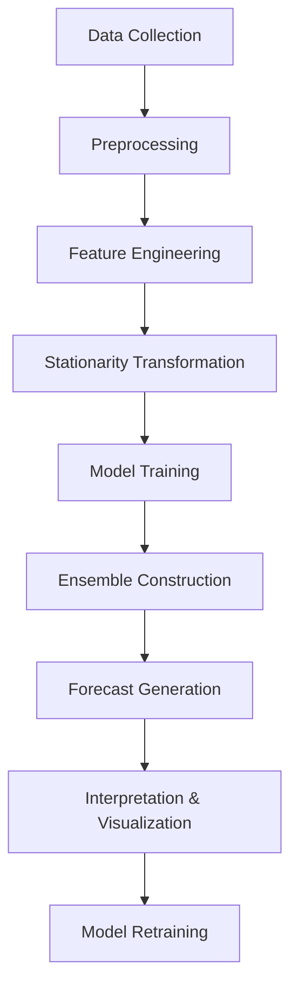

# Euro Area Inflation Forecasting Model

## Overview
This comprehensive forecasting system predicts Euro Area inflation using a robust machine learning pipeline that:
- Integrates economic data from multiple sources (FRED API and Excel)
- Performs advanced time series preprocessing
- Trains and compares multiple machine learning models
- Implements a stacking ensemble for improved accuracy
- Provides uncertainty quantification with Bayesian methods
- Features a retraining system for ongoing model maintenance
- Generates both MoM (Month-over-Month) and YoY (Year-over-Year) forecasts

## Key Features
- **Data Integration**: Combines 17+ economic indicators from FRED and custom Excel data
- **Advanced Preprocessing**: Automatic stationarity transformation with ADF/KPSS tests
- **Feature Engineering**: Creates meaningful interaction terms and lag features
- **Model Stacking**: Combines XGBoost, CatBoost, and SVR with Bayesian meta-model
- **Uncertainty Quantification**: Provides 90% confidence intervals for forecasts
- **Retraining System**: Automatic model updating with performance tracking
- **Visual Analytics**: Generates forecast visualizations with interpretation

## Methodology
### Data Pipeline
1. **Data Collection**: 
   - FRED API for economic indicators
   - Excel integration for money supply data
2. **Feature Engineering**:
   - Calculates YoY and MoM inflation
   - Creates interaction terms (e.g., Energy_Commodities × EUR_USD)
   - Generates lagged features (1-3 months)
   - Adds rolling statistics (3-month mean/std)
3. **Stationarity Transformation**:
   - Automated differencing with ADF/KPSS tests
   - Problematic feature removal
   - Linear interpolation for missing values

### Modeling Approach
1. **Model Selection**:
   - Bayesian-optimized XGBoost, CatBoost, SVR, and MLP
   - Quantile regression for uncertainty estimation
2. **Feature Selection**:
   - Recursive Feature Elimination with Cross-Validation
3. **Ensemble Construction**:
   - Manual stacking with out-of-fold predictions
   - Bayesian Ridge meta-model for uncertainty-aware predictions
4. **Evaluation**:
   - Time-series cross-validation
   - Comprehensive metrics (RMSE, MAE, MAPE)

### Production Features
- **Retraining System**: Automatic model updating with new data
- **Performance Tracking**: Stores historical metrics
- **Drift Detection**: Identifies data distribution shifts
- **Forecast Interpretation**: Provides economic insights

## Installation
# Clone repository
git clone https://github.com/yourusername/inflation-forecast.git
cd inflation-forecast

# Create and activate virtual environment
python -m venv venv
source venv/bin/activate  # Linux/Mac
venv\Scripts\activate     # Windows

# Install dependencies
pip install -r requirements.txt

## Dependencies
- Python 3.8+
- pandas
- numpy
- scikit-learn
- statsmodels
- xgboost
- catboost
- matplotlib
- seaborn
- fredapi
- tqdm
- joblib

## Usage
### Data Preparation:
- Place your Excel data at `C:\Users\Lewis Hayes\Documents\Portfolio Project\Money_Supply_Data.xlsx`
- Ensure FRED API key is valid in the code

### Run the Pipeline:
python inflation_forecast.py

## Output Files

- `raw_inflation_predictors.xlsx`  
  Initial raw dataset containing all collected economic indicators.

- `transformed_inflation_predictors.xlsx`  
  Processed dataset with calculated features such as lagged variables and rolling statistics.

- `comprehensive_stationary_dataset.xlsx`  
  Dataset after stationarity transformation applied to ensure model-ready data.

- `interaction_terms_stationary.xlsx`  
  Final dataset including engineered interaction terms with stationary features.

- Model performance visualizations (`.png`)  
  Graphs illustrating model accuracy, error metrics, and comparisons.

- `retraining_performance_log.csv`  
  Historical log of model metrics tracking retraining performance over time.

- `final_forecast_retraining.png`  
  Comprehensive visualization of the final forecast including uncertainty intervals.

---

## Forecast Interpretation

The system provides:

- Next month's **Month-over-Month (MoM) inflation** prediction with 90% confidence interval.

- Implied **Year-over-Year (YoY) inflation** forecast with 90% confidence interval.

- Economic insights including:  
  - Signals of upward or downward inflationary pressure.  
  - Assessment of compliance with the European Central Bank (ECB) inflation target.  
  - Evaluation of price stability trends and potential risks.

## Key Components

## Performance Metrics

Typical model performance on the test set:

| Model             | RMSE | MAE  |
|-------------------|------|------|
| XGBoost           | 0.32 | 0.22 |
| SVR               | 0.35 | 0.25 |
| CatBoost          | 0.31 | 0.21 |
| Neural Network    | 0.33 | 0.23 |
| Stacking Ensemble | 0.28 | 0.19 |

## Contact

For questions or support:  
Lewis Hayes - [lewisejhayes@gmail.com](mailto:lewisejhayes@gmail.com)
